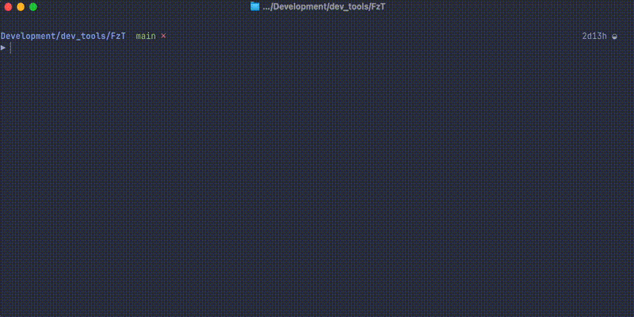

<div align="center">

# Fuzzy Test Finder

</div>

> ⚠️ This project is still pre-alpha and not released yet.
> ⚠️ This project was developed on MAC and only tested on MAC.


`Fuzzy Test Finder` is a developer tool that helps you quickly find relevant tests for a given piece of code using fuzzy matching techniques. It is designed to improve developer productivity by reducing the time spent searching for tests.

Here's an example of using `fuzzy-test-finder`:


## Quickstart

### Installation

First install the following dependencies:

```bash
brew install fzf
brew install expect
brew install bat
brew install ripgrep
# For nextest runtime
brew install cargo-nextest
```

If you want to use the tool for python please install:

```bash
pip install pytest-json-report
```

If you want to use the `--covered` feature please also install:

```bash
# For python
pip install pytest-cov

# For rust
cargo install cargo-tarpaulin
```

Then build the executable:

```bash
cargo build --release
```

Create an alias for easier access:

```sh
# Example in .zshrc
alias fzt="<PATH>/FuzzyTestFinder/target/release/FzT"
```

Create a `.fzt` folder in `~/`

```bash
mkdir ~/.fzt
```

If you want to parse java gradle teste do the following steps:

```bash
cd parsers/java
./gradlew shadowJar
cp app/build/libs/app-all.jar ~/.fzt/fzt-java-parser.jar
```

⚠️ If you encounter any issues after an update please run:

```bash
fzt --clear-cache
```

### Usage

First you need to set the default language for the project. That way you only have to tell the tool once.

```bash
fzt --default rust cargo
# or
fzt --default rust nextest
```

⚠️ It is recommended to use `nextest`, since it is much faster than using `cargo` as a runtime.

Afterwards you can fuzzy find the tests. You can do that on multiple modes:

```bash
# Fuzzy find each test, items are <FILE_PATH>::<TEST_NAME>
# THis is the standart mode
fzt -m test
# or
fzt

# Fuzzy find each test in its default runtime name.
# So in case of cargo: cache::manager::tests::get_non_existing_entry
fzt -m runtime

# Fuzzy find files. It will run all the tests in the selected files.
fzt -m file

# Fuzzy find directories. It will run all the tests in the selected directories.
fzt -m directory

# Append mode that allows you selecting multiple times form different modes.
fzt -m append

# Select window for modes
fzt -m s

# Select a preview mode
fzt -p test
fzt -p directory
fzt -p file
# Select preview mode
fzt -p s

# Runs all tests
fzt --all

# Select from history (each mode has a dedicated history)
fzt -h
fzt -m directory -h
fzt -m append -h

# Run last item
fzt -l
fzt -m directory -l
fzt -m append -l

# Select from failed tests from last run (all failed test are saved in a set)
# You can then also select them in a preferred mode
# If -f is set the failed test stay unchanged
# They only get refreshed if you run fzt without a debugger option and -f
# -f option has its own history, so to run the last test you run with the -f
# option, run -f -l
fzt -f
fzt -m directory -f
fzt -m append -f

# Run with debugger (currently only python)
# Set breakpoints with `breakpoint()` in the files
fzt -d pdb
# Get debugger selection window
fzt -d s

# clear cache
fzt --clear-cache

# Clear history
fzt --clear-history

# Run in verbose mode
fzt -v

# Parse arguments to runtime
fzt --all -- --locked ...

# Watch mode
# Run fzt in watch mode. It will re-run the last command when a file changes.
fzt --w
fzt --w -m directory
fzt -w --all


# See all test related to changed files
# Will pick up tests covering changed file since last run with -c or --covered
fzt -c
fzt --covered
```


#### All commands

```text
Usage: FzT [OPTIONS] [COMMAND] [ARGS]... [-- RUNTIME_ARGS]...

Commands:
  python
  java
  rust
  help    Print this message or the help of the given subcommand(s)

Options:
      --search-engine <SEARCH_ENGINE>  [possible values: FzF]
      --clear-cache                    Clear test build directory cache
      --help
      --default                        Make this runner the default one in the project
  -d, --debugger <DEBUGGER>            Debugger to use:

                                               Python: [pdb, ipdb, IPython, pudb, web-pdb] (set breakpoints with `breakpoint()` in code)

                                               Rust: []

                                               Java: []

                                               Open debugger selection menu if `s` or `select` is provided.

  -l, --last                           Run recently used test command. If no '--mode' provided defaults to 'test', 
                                       otherwise to the last command run in the corresponding mode.
  -h, --history                        Parse test items from history. If no '--mode' provided defaults to 'test', 
                                       otherwise to the tests from the history of the corresponding mode, can be selected.
      --clear-history                  Clear history
  -v, --verbose                        Prints out commands passed to the runtime
  -p, --preview <PREVIEW>              Preview test function symbol or file. If 'mode' is set to directory, then 
                                       'directory' is always used as preview. Preview is not used if '--history' is set,
                                       or granularity is 'runtime'.Open selection menu if `s` or `select` is provided. [
                                       possible values: file, test, directory, s, select]
  -a, --all                            Run all tests in project
  -m, --mode <MODE>                    Granularity of filtering. Can be 'test' for running a single test, 'runtime' for 
                                       running a single test based on its runtime argument, 'file' for running all tests 
                                       in a file, 'directory' for running all tests in a directory, 'append' for 
                                       continuing appending to the last selection. Open selection menu if `s` or `select` 
                                       is provided. [default: test] [possible values: directory, file, test, runtime, 
                                       append, s, select]
  -w, --watch                          Re-runs test selection when a file in your project changes
  -q, --query <QUERY>                  Start the finder with the given query
  -f, --failed                         Select from failed tests in the last run
  -c, --covered                        Tests that cover changed files, since last run with this option. Can not be run 
                                       with attached debugger. [EXPERIMENTAL] (slow performance) (only supports rust and 
                                       python RustPython)
  -V, --version                        Print version

Runtime Arguments:
  Arguments after -- are passed directly to the runtime
  Example: fzt -v python RustPython PyTest -- --pdb
```


## Supported languages

Currently supported languages:

- Python (pytest)
- Rust
- Java (JUnit with Gradle)

## License

This project is licensed under euther of

* Apache License, Version 2.0
* MIT license
